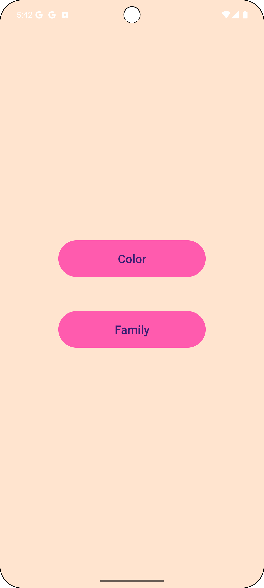
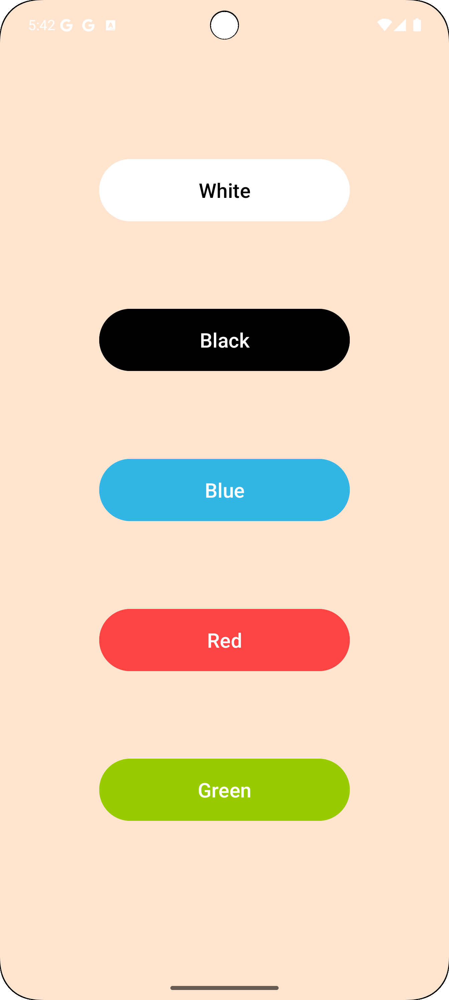
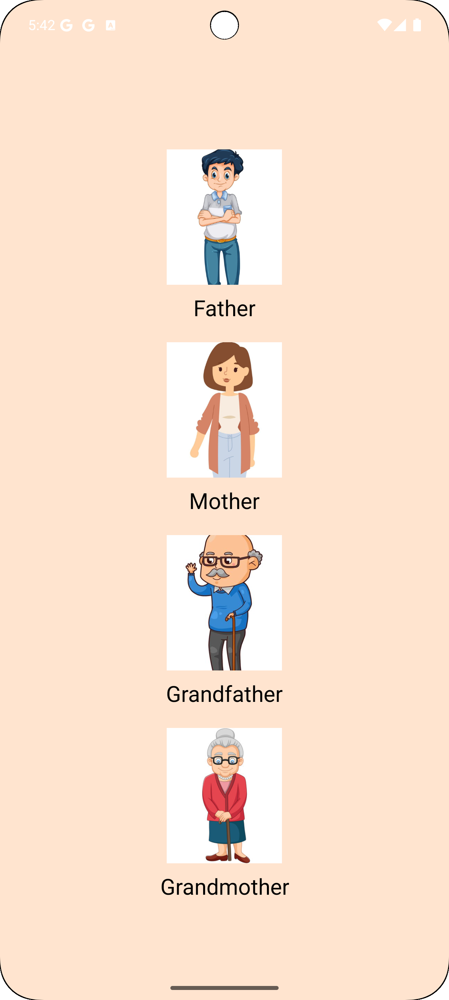

# Learning App

## Description
This is a simple Android learning app designed for children to help them learn about colors and family members through interactive buttons. Each button, when pressed, plays a sound associated with the color or family member, making the learning experience engaging and enjoyable.

## Features
- **Interactive Buttons**: Press buttons to hear sounds related to colors and family members.
- **Color Learning**: Includes buttons for five primary colors: White, Black, Blue, Red, and Green.
- **Family Learning**: Displays images and names for family members: Father, Mother, Grandfather, and Grandmother.
- **Edge-to-Edge Support**: Utilizes edge-to-edge design for a modern look.

## Screenshots
### Main Activity


### Color Activity

## Family Activity


## Installation
1. Clone this repository:
   ```bash
   git clone https://github.com/ranaehelal/Android_learning_app.git
   ```
2. Open the project in Android Studio.
3. Ensure that you have the required dependencies in your `build.gradle` file.
4. Sync the project with Gradle files.
5. Connect an Android device or start an emulator.
6. Run the app.

## Usage
1. Open the app to access the main menu.
2. Press the **Color** button to explore colors.
3. Press the **Family** button to learn about family members.
4. Each button will play a corresponding sound when pressed.

## Resources
- Images for colors and family members are located in the `drawable` folder.
- Sound files for colors are located in the `raw` folder.

## Contact

For questions or suggestions, feel free to reach out to [ranaesmailhelal@gmail.com](mailto:ranaesmailhelal@gmail.com).


